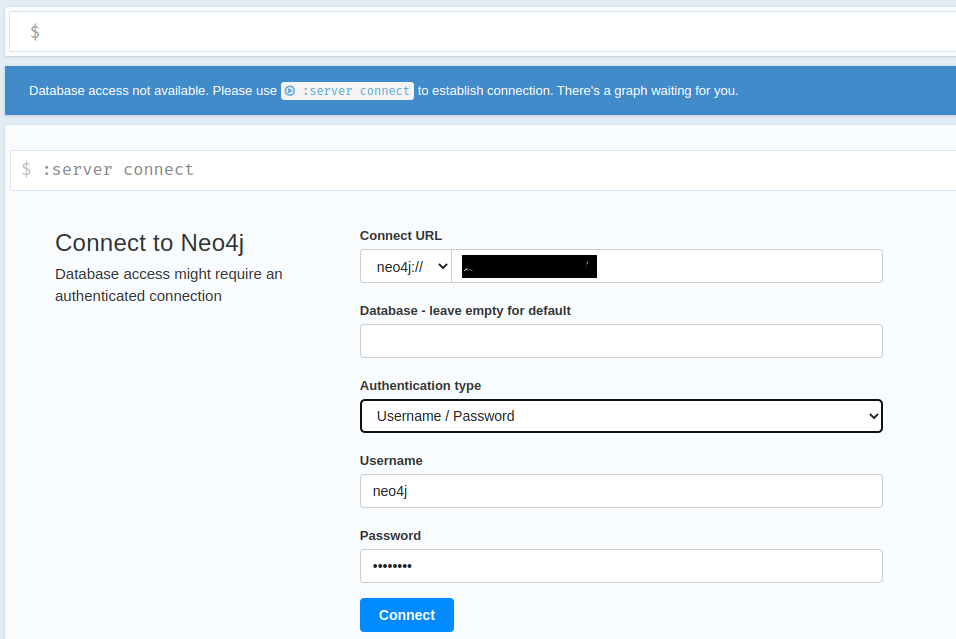
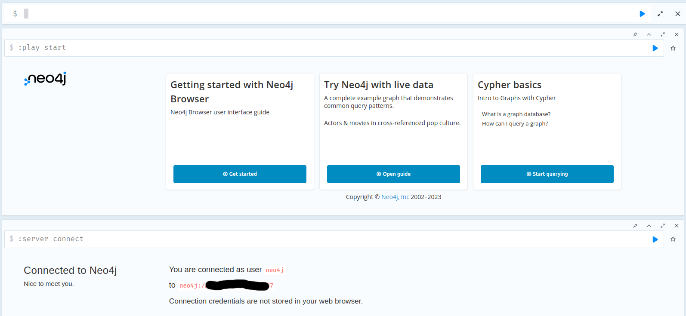
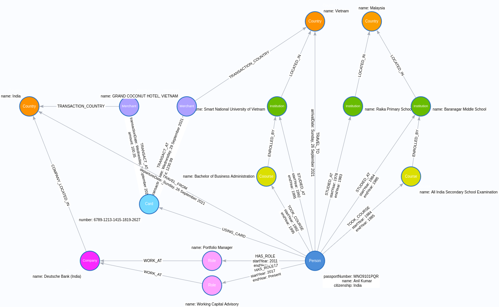
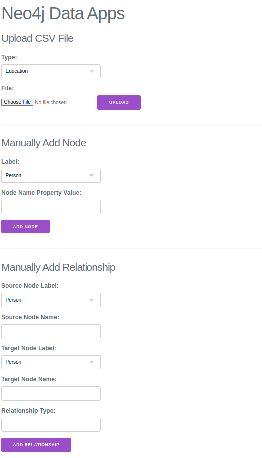
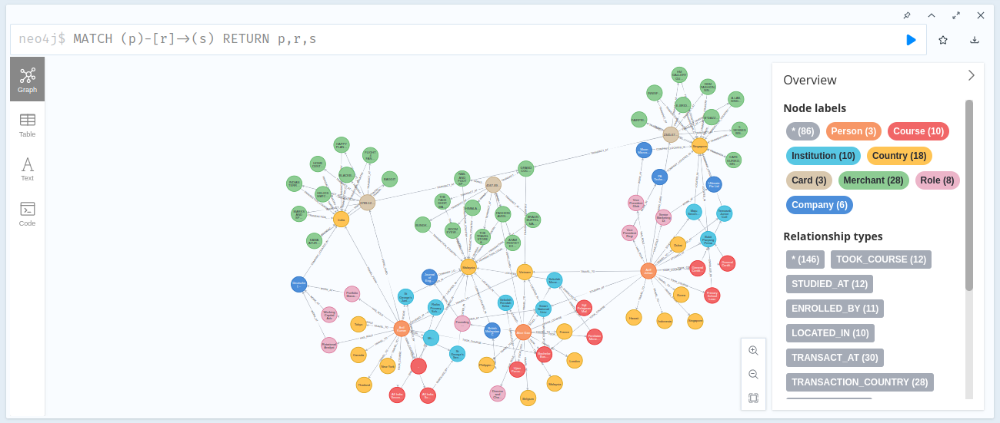
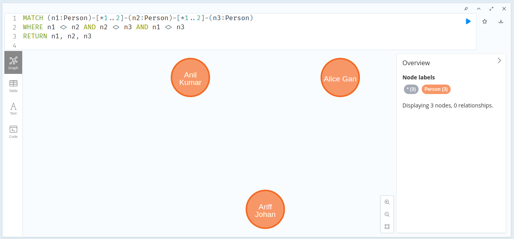
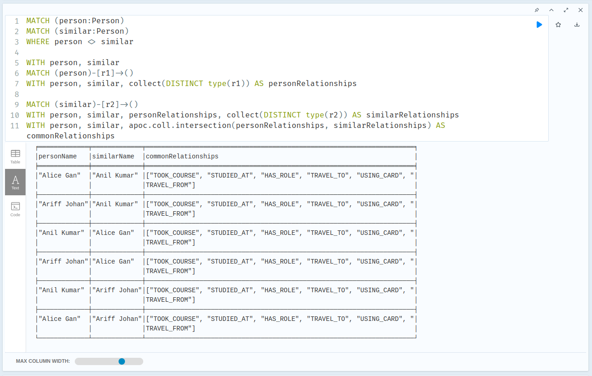
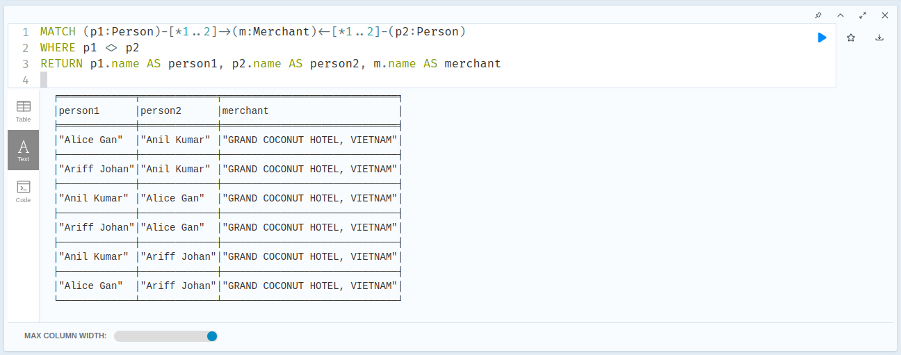
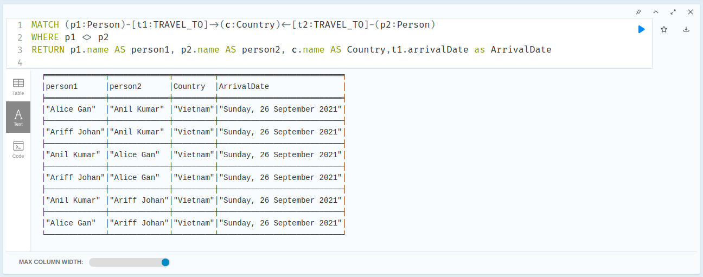

# Neo4j Sample Workshop

## VM Preparation

We need to prepare virtual machine for our Neo4j. For list of supported platfom, you can see it on Neo4j Documentation here: https://neo4j.com/docs/operations-manual/current/installation/requirements/

We can use cloud based infrastructure for our virtual machine. 

1. Create VM with 2vCPU dan 2GiB RAM using Ubuntu
2. Configure server firewall to allow these following ports:
    - Port 22       : for SSH
    - Port 5000     : for our Flask application
    - Port 7474     : Neo4j Browser
    - Port 7687     : Neo4j

3. Access our VM using SSH and install Docker https://docs.docker.com/engine/install/ubuntu/

4. Create persistent path

```console
mkdir neo4j
cd neo4j
mkdir data
mkdir logs
```

5. Set folder permission to neo4j user

```console
sudo useradd neo4j -p your-strong-password
sudo usermod -a -G neo4j neo4j
sudo chown neo4j:neo4j /path-to-your-data/neo4j/data
sudo chown neo4j:neo4j /path-to-your-data/logs
```

6. Run Neo4j Enterprise Docker images from DockerHub

```console

sudo docker run -d --rm\
    --publish=7474:7474 --publish=7687:7687 \
    --name neo4j-assignment \
    --env NEO4J_AUTH=neo4j/your-very-strong-password \
    --env NEO4J_ACCEPT_LICENSE_AGREEMENT=yes \
    --env NEO4J_apoc_export_file_enabled=true \
    --env NEO4J_apoc_import_file_enabled=true \
    --env NEO4J_apoc_import_file_use__neo4j__config=true \
    --env NEO4JLABS_PLUGINS='["bloom","apoc"]' \
    --volume=/your/path/to/data:/data \
    --volume=/your/path/to/logs:/logs \
    neo4j:5.8.0-enterprise
    
    
sudo docker run -d --rm\
    --publish=7474:7474 --publish=7687:7687 \
    --name neo4j-assignment \
    --env NEO4J_AUTH=neo4j/your-strong-password \
    --env NEO4J_ACCEPT_LICENSE_AGREEMENT=yes \
    --env NEO4J_apoc_export_file_enabled=true \
    --env NEO4J_apoc_import_file_enabled=true \
    --env NEO4J_apoc_import_file_use__neo4j__config=true \
    --env NEO4JLABS_PLUGINS=\[\"apoc\"\] \
    --env NEO4J_PLUGINS='["bloom"]' \
    --volume=/your/path/to/data:/data \
    --volume=/your/path/to/logs:/logs \
    neo4j:5.8.0-enterprise
```

7. Using your local browser, test Neo4j Browser by accessing `http://your-server-address:7474`, and setup your database credentials



8. You will get into Neo4j Browser



## Prepare dataset

We will use sample dataset from here: https://gist.github.com/maruthiprithivi/10b456c74ba99a35a52caaffafb9d3dc. Please download those 4 files into your local drive.

We will use following model for our database:



You can download JSON model definition for Arrows.app [here](assets/SocialNetworkGraphModel.json). You also can view directly in Arrows.app [on this link](https://arrows.app/#/import/json=eyJncmFwaCI6eyJub2RlcyI6W3siaWQiOiJuMCIsInBvc2l0aW9uIjp7IngiOi0xMDYsInkiOjE1Nn0sImNhcHRpb24iOiJQZXJzb24iLCJsYWJlbHMiOlsiUGVyc29uIl0sInByb3BlcnRpZXMiOnsicGFzc3BvcnROdW1iZXIiOiJNTk85MTAxUFFSIiwibmFtZSI6IkFuaWwgS3VtYXIiLCJjaXRpemVuc2hpcCI6IkluZGlhIn0sInN0eWxlIjp7fX0seyJpZCI6Im4xIiwicG9zaXRpb24iOnsieCI6LTQuNjY0OTA3NTQ3MDc5NDgsInkiOi0yNTUuOTQ3NjUzODMzMTAyNTV9LCJjYXB0aW9uIjoiSW5zdGl0dXRpb24iLCJsYWJlbHMiOlsiSW5zdGl0dXRpb24iXSwicHJvcGVydGllcyI6eyJuYW1lIjoiUmFpa2EgUHJpbWFyeSBTY2hvb2wifSwic3R5bGUiOnsibm9kZS1jb2xvciI6IiM2OGJjMDAifX0seyJpZCI6Im4yIiwicG9zaXRpb24iOnsieCI6NDUuNTIyNzM1NTMzMDMwNTg0LCJ5IjotNDgyLjc4MjkwNzgyMDcwMjd9LCJjYXB0aW9uIjoiQ291bnRyeSIsImxhYmVscyI6WyJDb3VudHJ5Il0sInByb3BlcnRpZXMiOnsibmFtZSI6Ik1hbGF5c2lhIn0sInN0eWxlIjp7Im5vZGUtY29sb3IiOiIjZmI5ZTAwIn19LHsiaWQiOiJuMyIsInBvc2l0aW9uIjp7IngiOjE1MC4yNTExNjM0NjkwNTQxMiwieSI6LTY4Ljg4MDIyODMyMjAzODIyfSwiY2FwdGlvbiI6IkNvdXJzZSIsImxhYmVscyI6WyJDb3Vyc2UiXSwicHJvcGVydGllcyI6eyJuYW1lIjoiQWxsIEluZGlhIFNlY29uZGFyeSBTY2hvb2wgRXhhbWluYXRpb24ifSwic3R5bGUiOnsibm9kZS1jb2xvciI6IiNkYmRmMDAifX0seyJpZCI6Im40IiwicG9zaXRpb24iOnsieCI6MTc2LjQ4NjEzMDQ4NDQ2ODY3LCJ5IjotMjU1Ljk0NzY1MzgzMzEwMjU1fSwiY2FwdGlvbiI6Ikluc3RpdHV0aW9uIiwibGFiZWxzIjpbIkluc3RpdHV0aW9uIl0sInByb3BlcnRpZXMiOnsibmFtZSI6IkJhcmFuYWdhciBNaWRkbGUgU2Nob29sIn0sInN0eWxlIjp7Im5vZGUtY29sb3IiOiIjNjhiYzAwIn19LHsiaWQiOiJuNyIsInBvc2l0aW9uIjp7IngiOi0yMDcuMzM1MDkyNDUyOTIwNTIsInkiOi0yNTUuOTQ3NjUzODMzMTAyNTV9LCJjYXB0aW9uIjoiSW5zdGl0dXRpb24iLCJsYWJlbHMiOlsiSW5zdGl0dXRpb24iXSwicHJvcGVydGllcyI6eyJuYW1lIjoiU21hcnQgTmF0aW9uYWwgVW5pdmVyc2l0eSBvZiBWaWV0bmFtIn0sInN0eWxlIjp7Im5vZGUtY29sb3IiOiIjNjhiYzAwIn19LHsiaWQiOiJuOCIsInBvc2l0aW9uIjp7IngiOi0xMDYsInkiOi00ODIuNzgyOTA3ODIwNzAyN30sImNhcHRpb24iOiJDb3VudHJ5IiwibGFiZWxzIjpbIkNvdW50cnkiXSwicHJvcGVydGllcyI6eyJuYW1lIjoiVmlldG5hbSJ9LCJzdHlsZSI6eyJub2RlLWNvbG9yIjoiI2ZlOTIwMCJ9fSx7ImlkIjoibjExIiwicG9zaXRpb24iOnsieCI6LTIzNS44MzQ2NjAzNTcxNTMzNSwieSI6LTY4Ljg4MDIyODMyMjAzODIyfSwiY2FwdGlvbiI6IkNvb3Vyc2UiLCJsYWJlbHMiOltdLCJwcm9wZXJ0aWVzIjp7Im5hbWUiOiJCYWNoZWxvciBvZiBCdXNpbmVzcyBBZG1pbmlzdHJhdGlvbiJ9LCJzdHlsZSI6eyJub2RlLWNvbG9yIjoiI2RiZGYwMCJ9fSx7ImlkIjoibjEyIiwicG9zaXRpb24iOnsieCI6LTU0OC43NDk0MzczODg0MTE5LCJ5Ijo0Ljg4Mzk1MjAwODYxNDQ3NX0sImNhcHRpb24iOiJDYXJkIiwibGFiZWxzIjpbIkNhcmQiXSwicHJvcGVydGllcyI6eyJudW1iZXIiOiI2Nzg5LTEyMTMtMTQxNS0xODE5LTI2MjcifSwic3R5bGUiOnsibm9kZS1jb2xvciI6IiM3M2Q4ZmYifX0seyJpZCI6Im4xMyIsInBvc2l0aW9uIjp7IngiOi02MDIuMjQzMTczMDUyOTg4NCwieSI6LTI1NS45NDc2NTM4MzMxMDI1NX0sImNhcHRpb24iOiJNZXJjaGFudCIsImxhYmVscyI6WyJNZXJjaGFudCJdLCJwcm9wZXJ0aWVzIjp7Im5hbWUiOiJCQUdHSVQifSwic3R5bGUiOnsibm9kZS1jb2xvciI6IiNhZWExZmYifX0seyJpZCI6Im4xNCIsInBvc2l0aW9uIjp7IngiOi04NjguNTAzNzcxNjQyNjQxNiwieSI6LTI1NS45NDc2NTM4MzMxMDI1NX0sImNhcHRpb24iOiJDb3VudHJ5IiwibGFiZWxzIjpbIkNvdW50cnkiXSwicHJvcGVydGllcyI6eyJuYW1lIjoiSW5kaWEifSwic3R5bGUiOnsibm9kZS1jb2xvciI6IiNmZTkyMDAifX0seyJpZCI6Im4xNSIsInBvc2l0aW9uIjp7IngiOi00NDguMzEzMjUzMTYxMzM4MzcsInkiOi0yNTUuOTQ3NjUzODMzMTAyNTV9LCJjYXB0aW9uIjoiTWVyY2hhbnQiLCJsYWJlbHMiOlsiTWVyY2hhbnQiXSwicHJvcGVydGllcyI6eyJuYW1lIjoiR1JBTkQgQ09DT05VVCBIT1RFTCwgVklFVE5BTSJ9LCJzdHlsZSI6eyJub2RlLWNvbG9yIjoiI2FlYTFmZiJ9fSx7ImlkIjoibjE2IiwicG9zaXRpb24iOnsieCI6LTM4MC44NjEyNTk2NDIzMTkyLCJ5IjoxNTZ9LCJjYXB0aW9uIjoiUm9sZSIsImxhYmVscyI6WyJSb2xlIl0sInByb3BlcnRpZXMiOnsibmFtZSI6IlBvcnRmb2xpbyBNYW5hZ2VyIn0sInN0eWxlIjp7Im5vZGUtY29sb3IiOiIjZmRhMWZmIn19LHsiaWQiOiJuMTciLCJwb3NpdGlvbiI6eyJ4IjotNzA2Ljg0MTkyODA1OTQyMzQsInkiOjE1Nn0sImNhcHRpb24iOiJDb21wYW55IiwibGFiZWxzIjpbIkNvbXBhbnkiXSwicHJvcGVydGllcyI6eyJuYW1lIjoiRGV1dHNjaGUgQmFuayAoSW5kaWEpIn0sInN0eWxlIjp7Im5vZGUtY29sb3IiOiIjZmEyOGZmIn19LHsiaWQiOiJuMTgiLCJwb3NpdGlvbiI6eyJ4IjotMzgwLjg2MTI1OTY0MjMxOTIsInkiOjIyMS45MDc5OTIxMDgyNDczfSwiY2FwdGlvbiI6IlJvbGUiLCJsYWJlbHMiOlsiUm9sZSJdLCJwcm9wZXJ0aWVzIjp7Im5hbWUiOiJXb3JraW5nIENhcGl0YWwgQWR2aXNvcnkifSwic3R5bGUiOnsibm9kZS1jb2xvciI6IiNmZGExZmYifX1dLCJyZWxhdGlvbnNoaXBzIjpbeyJpZCI6Im4wIiwiZnJvbUlkIjoibjAiLCJ0b0lkIjoibjEiLCJ0eXBlIjoiU1RVRElFRF9BVCIsInByb3BlcnRpZXMiOnsic3RhcnRZZWFyIjoiMTk3OCIsImVuZFllYXIiOiIxOTgzIn0sInN0eWxlIjp7fX0seyJpZCI6Im4xIiwiZnJvbUlkIjoibjEiLCJ0b0lkIjoibjIiLCJ0eXBlIjoiTE9DQVRFRF9JTiIsInByb3BlcnRpZXMiOnt9LCJzdHlsZSI6e319LHsiaWQiOiJuMiIsImZyb21JZCI6Im4wIiwidG9JZCI6Im4zIiwidHlwZSI6IlRPT0tfQ09VUlNFIiwicHJvcGVydGllcyI6eyJzdGFydFllYXIiOiIxOTg0IiwiZW5kWWVhciI6IjE5ODUifSwic3R5bGUiOnt9fSx7ImlkIjoibjMiLCJmcm9tSWQiOiJuMCIsInRvSWQiOiJuNCIsInR5cGUiOiJTVFVESUVEX0FUIiwicHJvcGVydGllcyI6eyJzdGFydFllYXIiOiIxOTg0IiwiZW5kWWVhciI6IjE5ODUifSwic3R5bGUiOnt9fSx7ImlkIjoibjQiLCJmcm9tSWQiOiJuMyIsInRvSWQiOiJuNCIsInR5cGUiOiJFTlJPTExFRF9CWSIsInByb3BlcnRpZXMiOnt9LCJzdHlsZSI6e319LHsiaWQiOiJuNSIsImZyb21JZCI6Im40IiwidG9JZCI6Im4yIiwidHlwZSI6IkxPQ0FURURfSU4iLCJwcm9wZXJ0aWVzIjp7fSwic3R5bGUiOnt9fSx7ImlkIjoibjEwIiwiZnJvbUlkIjoibjAiLCJ0b0lkIjoibjciLCJ0eXBlIjoiU1RVRElFRF9BVCIsInByb3BlcnRpZXMiOnsic3RhcnRZZWFyIjoiMTk5MiIsImVuZFllYXIiOiIxOTk1In0sInN0eWxlIjp7fX0seyJpZCI6Im4xMSIsImZyb21JZCI6Im43IiwidG9JZCI6Im44IiwidHlwZSI6IkxPQ0FURURfSU4iLCJwcm9wZXJ0aWVzIjp7fSwic3R5bGUiOnt9fSx7ImlkIjoibjE0IiwiZnJvbUlkIjoibjAiLCJ0b0lkIjoibjExIiwidHlwZSI6IlRPT0tfQ09VUlNFIiwicHJvcGVydGllcyI6eyJzdGFydFllYXIiOiIxOTkyIiwiZW5kWWVhciI6IjE5OTUifSwic3R5bGUiOnt9fSx7ImlkIjoibjIyIiwiZnJvbUlkIjoibjExIiwidG9JZCI6Im43IiwidHlwZSI6IkVOUk9MTEVEX0JZIiwicHJvcGVydGllcyI6e30sInN0eWxlIjp7fX0seyJpZCI6Im4yMyIsImZyb21JZCI6Im4wIiwidG9JZCI6Im4xMiIsInR5cGUiOiJVU0lOR19DQVJEIiwicHJvcGVydGllcyI6e30sInN0eWxlIjp7fX0seyJpZCI6Im4yNCIsImZyb21JZCI6Im4xMiIsInRvSWQiOiJuMTMiLCJ0eXBlIjoiVFJBTlNBQ1RfQVQiLCJwcm9wZXJ0aWVzIjp7InRyYW5zYWN0aW9uRGF0ZSI6IldlZG5lc2RheSwgMSBTZXB0ZW1iZXIgMjAyMSIsImFtb3VudCI6IjEwMC4zNSJ9LCJzdHlsZSI6e319LHsiaWQiOiJuMjUiLCJmcm9tSWQiOiJuMTMiLCJ0b0lkIjoibjE0IiwidHlwZSI6IlRSQU5TQUNUSU9OX0NPVU5UUlkiLCJwcm9wZXJ0aWVzIjp7fSwic3R5bGUiOnt9fSx7ImlkIjoibjI2IiwiZnJvbUlkIjoibjEyIiwidG9JZCI6Im4xNSIsInR5cGUiOiJUUkFOU0FDVF9BVCIsInByb3BlcnRpZXMiOnsidHJhbnNhY3Rpb25EYXRlIjoiV2VkbmVzZGF5LCAyOSBTZXB0ZW1iZXIgMjAyMSIsImFtb3VudCI6IjEyMzAuOTkifSwic3R5bGUiOnt9fSx7ImlkIjoibjI3IiwiZnJvbUlkIjoibjE1IiwidG9JZCI6Im44IiwidHlwZSI6IlRSQU5TQUNUSU9OX0NPVU5UUlkiLCJwcm9wZXJ0aWVzIjp7fSwic3R5bGUiOnt9fSx7ImlkIjoibjI4IiwiZnJvbUlkIjoibjAiLCJ0b0lkIjoibjE0IiwidHlwZSI6IlRSQVZFTF9GUk9NIiwicHJvcGVydGllcyI6eyJkZXBhcnR1cmVEYXRlIjoiU3VuZGF5LCAyNiBTZXB0ZW1iZXIgMjAyMSJ9LCJzdHlsZSI6e319LHsiaWQiOiJuMjkiLCJmcm9tSWQiOiJuMCIsInRvSWQiOiJuOCIsInR5cGUiOiJUUkFWRUxfVE8iLCJwcm9wZXJ0aWVzIjp7ImFycml2YWxEYXRlIjoiU3VuZGF5LCAyNiBTZXB0ZW1iZXIgMjAyMSJ9LCJzdHlsZSI6e319LHsiaWQiOiJuMzAiLCJmcm9tSWQiOiJuMCIsInRvSWQiOiJuMTYiLCJ0eXBlIjoiSEFTX1JPTEUiLCJwcm9wZXJ0aWVzIjp7InN0YXJ0WWVhciI6IjIwMTEiLCJlbmRZZWFyIjoiMjAxNyJ9LCJzdHlsZSI6e319LHsiaWQiOiJuMzEiLCJmcm9tSWQiOiJuMTYiLCJ0b0lkIjoibjE3IiwidHlwZSI6IldPUktfQVQiLCJwcm9wZXJ0aWVzIjp7fSwic3R5bGUiOnt9fSx7ImlkIjoibjMyIiwiZnJvbUlkIjoibjE3IiwidG9JZCI6Im4xNCIsInR5cGUiOiJDT01QQU5ZX0xPQ0FURURfSU4iLCJwcm9wZXJ0aWVzIjp7fSwic3R5bGUiOnt9fSx7ImlkIjoibjMzIiwiZnJvbUlkIjoibjAiLCJ0b0lkIjoibjE4IiwidHlwZSI6IkhBU19ST0xFIiwicHJvcGVydGllcyI6eyJzdGFydFllYXIiOiIyMDE3IiwiZW5kWWVhciI6IlByZXNlbnQifSwic3R5bGUiOnt9fSx7ImlkIjoibjM0IiwiZnJvbUlkIjoibjE4IiwidG9JZCI6Im4xNyIsInR5cGUiOiJXT1JLX0FUIiwicHJvcGVydGllcyI6e30sInN0eWxlIjp7fX1dLCJzdHlsZSI6eyJmb250LWZhbWlseSI6InNhbnMtc2VyaWYiLCJiYWNrZ3JvdW5kLWNvbG9yIjoiI0ZBRkNGRiIsImJhY2tncm91bmQtaW1hZ2UiOiIiLCJiYWNrZ3JvdW5kLXNpemUiOiIxMDAlIiwibm9kZS1jb2xvciI6IiM0QzhFREEiLCJib3JkZXItd2lkdGgiOjIsImJvcmRlci1jb2xvciI6IiMyODcwYzIiLCJyYWRpdXMiOjI1LCJub2RlLXBhZGRpbmciOjUsIm5vZGUtbWFyZ2luIjoyLCJvdXRzaWRlLXBvc2l0aW9uIjoiYXV0byIsIm5vZGUtaWNvbi1pbWFnZSI6IiIsIm5vZGUtYmFja2dyb3VuZC1pbWFnZSI6IiIsImljb24tcG9zaXRpb24iOiJpbnNpZGUiLCJpY29uLXNpemUiOjY0LCJjYXB0aW9uLXBvc2l0aW9uIjoiaW5zaWRlIiwiY2FwdGlvbi1tYXgtd2lkdGgiOjIwMCwiY2FwdGlvbi1jb2xvciI6IiNmZmZmZmYiLCJjYXB0aW9uLWZvbnQtc2l6ZSI6MTAsImNhcHRpb24tZm9udC13ZWlnaHQiOiJub3JtYWwiLCJsYWJlbC1wb3NpdGlvbiI6Im91dHNpZGUiLCJsYWJlbC1kaXNwbGF5IjoiYmFyZSIsImxhYmVsLWNvbG9yIjoiI2ZmZmZmZiIsImxhYmVsLWJhY2tncm91bmQtY29sb3IiOiIjNEM4RURBIiwibGFiZWwtYm9yZGVyLWNvbG9yIjoiIzRDOEVEQSIsImxhYmVsLWJvcmRlci13aWR0aCI6MCwibGFiZWwtZm9udC1zaXplIjoxMCwibGFiZWwtcGFkZGluZyI6MiwibGFiZWwtbWFyZ2luIjoyLCJkaXJlY3Rpb25hbGl0eSI6ImRpcmVjdGVkIiwiZGV0YWlsLXBvc2l0aW9uIjoiaW5saW5lIiwiZGV0YWlsLW9yaWVudGF0aW9uIjoicGFyYWxsZWwiLCJhcnJvdy13aWR0aCI6MSwiYXJyb3ctY29sb3IiOiIjQTVBQkI2IiwibWFyZ2luLXN0YXJ0IjowLCJtYXJnaW4tZW5kIjowLCJtYXJnaW4tcGVlciI6MjAsImF0dGFjaG1lbnQtc3RhcnQiOiJub3JtYWwiLCJhdHRhY2htZW50LWVuZCI6Im5vcm1hbCIsInJlbGF0aW9uc2hpcC1pY29uLWltYWdlIjoiIiwidHlwZS1jb2xvciI6IiMwMDAwMDAiLCJ0eXBlLWJhY2tncm91bmQtY29sb3IiOiIjZmZmZmZmIiwidHlwZS1ib3JkZXItY29sb3IiOiIjMDAwMDAwIiwidHlwZS1ib3JkZXItd2lkdGgiOjAsInR5cGUtZm9udC1zaXplIjoxMCwidHlwZS1wYWRkaW5nIjoyLCJwcm9wZXJ0eS1wb3NpdGlvbiI6Im91dHNpZGUiLCJwcm9wZXJ0eS1hbGlnbm1lbnQiOiJjb2xvbiIsInByb3BlcnR5LWNvbG9yIjoiIzAwMDAwMCIsInByb3BlcnR5LWZvbnQtc2l6ZSI6MTAsInByb3BlcnR5LWZvbnQtd2VpZ2h0Ijoibm9ybWFsIn19LCJkaWFncmFtTmFtZSI6IlNvY2lhbCBOZXR3b3JrIEdyYXBoIE1vZGVsIn0=)

## Create and Deploy Sample Application

1. Prepare server Python libraries

```console
pip install flask
pip install neo4j
pip install flask-wtf wtforms
pip install flask_login
```

2. We provide sample application here: https://github.com/divaga/neo4j-sample-workshop/tree/main/apps, you can download and copy it into your virtual machine. Modify app.py for Neo4j address, password and also application credentials.

3. Start this application by execute this command:

```console
flask run --host=0.0.0.0
```

4. After login, you can see our sample application running.



5. You can upload csv files to automatically create nodes and relationship or you can manually create nodes and relationship.

## Exploratory Cypher queries

You can try following exploratory Cypher queries using Neo4j Browser

1. Show all nodes

```cypher
MATCH (p)-[r]->(s) RETURN p,r,s
```




2. Finding which person is has up to 2 degrees of relationships

```cypher
MATCH (n1:Person)-[*1..2]-(n2:Person)-[*1..2]-(n3:Person)
WHERE n1 <> n2 AND n2 <> n3 AND n1 <> n3
RETURN n1, n2, n3
```




3. Finding similar relationships between persons

```cypher
MATCH (person:Person)
MATCH (similar:Person)
WHERE person <> similar

WITH person, similar
MATCH (person)-[r1]->()
WITH person, similar, collect(DISTINCT type(r1)) AS personRelationships

MATCH (similar)-[r2]->()
WITH person, similar, personRelationships, collect(DISTINCT type(r2)) AS similarRelationships
WITH person, similar, apoc.coll.intersection(personRelationships, similarRelationships) AS commonRelationships
RETURN person.name AS personName, similar.name AS similarName, commonRelationships
```




4. Finding similar transaction for all person

```cypher
MATCH (p1:Person)-[*1..2]->(m:Merchant)<-[*1..2]-(p2:Person)
WHERE p1 <> p2
RETURN p1.name AS person1, p2.name AS person2, m.name AS merchant
```




5. Finding similar travel destination

```cypher
MATCH (p1:Person)-[t1:TRAVEL_TO]->(c:Country)<-[t2:TRAVEL_TO]-(p2:Person)
WHERE p1 <> p2
RETURN p1.name AS person1, p2.name AS person2, c.name AS Country,t1.arrivalDate as ArrivalDate
```




6. Finding similar education background

```cypher
MATCH (p1:Person)-[t1:STUDIED_AT]->(c:Institution)<-[t2:STUDIED_AT]-(p2:Person)
WHERE p1 <> p2
RETURN p1.name AS person1, p2.name AS person2, c.name AS Institution
```


