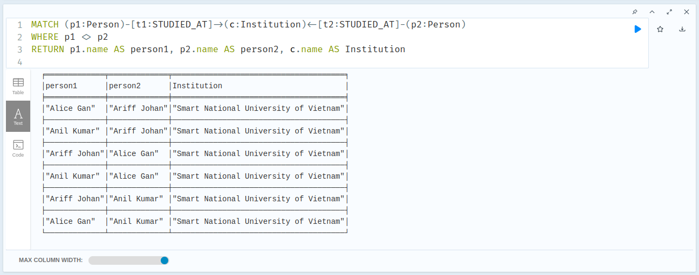

# Neo4j Sample Workshop

## VM Preparation

We need to prepare virtual machine for our Neo4j. For list of supported platfom, you can see it on Neo4j Documentation here: https://neo4j.com/docs/operations-manual/current/installation/requirements/

We can use cloud based infrastructure for our virtual machine. 

1. Create VM with 2vCPU dan 2GiB RAM using Ubuntu
2. Configure server firewall to allow these following ports:
    - Port 22       : for SSH
    - Port 5000     : for our Flask application
    - Port 7474     : Neo4j Browser
    - Port 7687     : Neo4j

3. Access our VM using SSH and install Docker https://docs.docker.com/engine/install/ubuntu/

4. Create persistent path

```console
mkdir neo4j
cd neo4j
mkdir data
mkdir logs
```

5. Set folder permission to neo4j user

```console
sudo useradd neo4j -p your-strong-password
sudo usermod -a -G neo4j neo4j
sudo chown neo4j:neo4j /path-to-your-data/neo4j/data
sudo chown neo4j:neo4j /path-to-your-data/logs
```

6. Run Neo4j Enterprise Docker images from DockerHub

```console

sudo docker run -d --rm\
    --publish=7474:7474 --publish=7687:7687 \
    --name neo4j-assignment \
    --env NEO4J_AUTH=neo4j/your-very-strong-password \
    --env NEO4J_ACCEPT_LICENSE_AGREEMENT=yes \
    --env NEO4J_apoc_export_file_enabled=true \
    --env NEO4J_apoc_import_file_enabled=true \
    --env NEO4J_apoc_import_file_use__neo4j__config=true \
    --env NEO4JLABS_PLUGINS='["bloom","apoc"]' \
    --volume=/your/path/to/data:/data \
    --volume=/your/path/to/logs:/logs \
    neo4j:5.8.0-enterprise
    
    
sudo docker run -d --rm\
    --publish=7474:7474 --publish=7687:7687 \
    --name neo4j-assignment \
    --env NEO4J_AUTH=neo4j/your-strong-password \
    --env NEO4J_ACCEPT_LICENSE_AGREEMENT=yes \
    --env NEO4J_apoc_export_file_enabled=true \
    --env NEO4J_apoc_import_file_enabled=true \
    --env NEO4J_apoc_import_file_use__neo4j__config=true \
    --env NEO4JLABS_PLUGINS=\[\"apoc\"\] \
    --env NEO4J_PLUGINS='["bloom"]' \
    --volume=/your/path/to/data:/data \
    --volume=/your/path/to/logs:/logs \
    neo4j:5.8.0-enterprise
```

7. Using your local browser, test Neo4j Browser by accessing `http://your-server-address:7474`, and setup your database credentials


8. You will get into Neo4j Browser


## Prepare dataset

We will use sample dataset from here: https://gist.github.com/maruthiprithivi/10b456c74ba99a35a52caaffafb9d3dc. Please download those 4 files into your local drive.

We will use following model for our database:


You can download JSON model definition for Arrows.app [here](assets/SocialNetworkGraphModel.json)

## Create and Deploy Sample Application

1. Prepare server Python libraries

```console
pip install flask
pip install neo4j
pip install flask-wtf wtforms
pip install flask_login
```

2. We provide sample application here: https://github.com/divaga/neo4j-sample-workshop/tree/main/apps, you can download and copy it into your virtual machine. Modify app.py for Neo4j address, password and also application credentials.

3. Start this application by execute this command:

```console
flask run --host=0.0.0.0
```

4. After login, you can see our sample application running.


5. You can upload csv files to automatically create nodes and relationship or you can manually create nodes and relationship.

## Exploratory Cypher queries

You can try following exploratory Cypher queries using Neo4j Browser

1. Show all nodes

```cypher
MATCH (p)-[r]->(s) RETURN p,r,s
```


2. Finding which person is has up to 2 degrees of relationships

```cypher
MATCH (n1:Person)-[*1..2]-(n2:Person)-[*1..2]-(n3:Person)
WHERE n1 <> n2 AND n2 <> n3 AND n1 <> n3
RETURN n1, n2, n3
```


3. Finding similar relationships between persons

```cypher
MATCH (person:Person)
MATCH (similar:Person)
WHERE person <> similar

WITH person, similar
MATCH (person)-[r1]->()
WITH person, similar, collect(DISTINCT type(r1)) AS personRelationships

MATCH (similar)-[r2]->()
WITH person, similar, personRelationships, collect(DISTINCT type(r2)) AS similarRelationships
WITH person, similar, apoc.coll.intersection(personRelationships, similarRelationships) AS commonRelationships
RETURN person.name AS personName, similar.name AS similarName, commonRelationships
```


4. Finding similar transaction for all person

```cypher
MATCH (p1:Person)-[*1..2]->(m:Merchant)<-[*1..2]-(p2:Person)
WHERE p1 <> p2
RETURN p1.name AS person1, p2.name AS person2, m.name AS merchant
```


5. Finding similar travel destination

```cypher
MATCH (p1:Person)-[t1:TRAVEL_TO]->(c:Country)<-[t2:TRAVEL_TO]-(p2:Person)
WHERE p1 <> p2
RETURN p1.name AS person1, p2.name AS person2, c.name AS Country,t1.arrivalDate as ArrivalDate
```


6. Finding similar education background

```cypher
MATCH (p1:Person)-[t1:STUDIED_AT]->(c:Institution)<-[t2:STUDIED_AT]-(p2:Person)
WHERE p1 <> p2
RETURN p1.name AS person1, p2.name AS person2, c.name AS Institution
```




